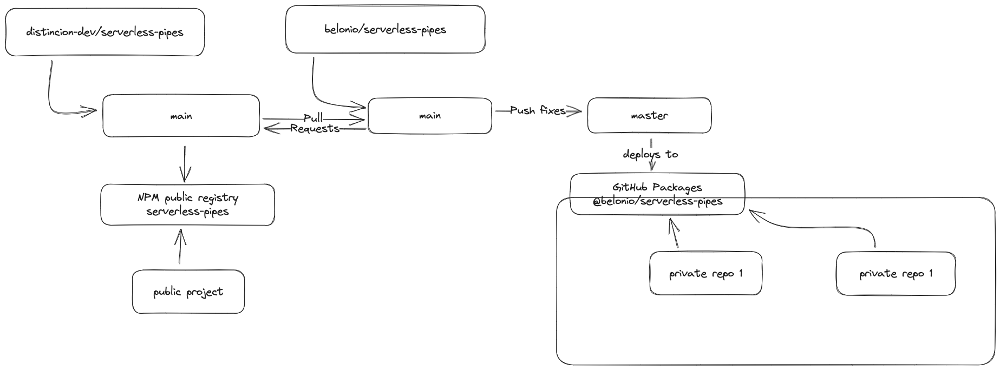

# Serverless Pipes Plugin

Serverless Framework plugin called as "pipes", used to create EventBridge Pipes by providing the required event sources, targets and other parameters as needed.

## Pull-back changes from original author:

Communication between the original author only takes place using the main branches.
master branch is used to deploy changes to our GitHub Packages Storage, meaning after updates to main, always merge `main -> master` !

- Pull back changes from origin: [distincion-dev/serverless-pipes:main -> belonio/serverless-pipes:main](https://github.com/belonio/serverless-pipes/compare/main...distinction-dev:serverless-pipes:main)
- State pull request against origin: [belonio/serverless-pipes:main -> distincion-dev/serverless-pipes:main](https://github.com/belonio/serverless-pipes/compare/distinction-dev:serverless-pipes:main...main)

DON'T FORGET: Real fixes are done against main and then merged to master, as master is solely considered as deployment gateway! Also, this ensures changes being able to go to the origin repository!



## Install

```bash
npm install serverless-pipes
```

or

```bash
yarn add serverless-pipes
```

## Allowed Services

At the initial version of the plugin, the below mentioned AWS services are supported for the source, target and enrichment in the EventBridge Pipes. We will expand to other services in the future.

### Source

- [SQS](docs/parameters/SQSSourceParameters.md)
- [DynamoDB](docs/parameters/DynamoDBSourceParameters.md)
- [Kinesis Streams](docs/parameters/KinesisStreamSourceParameters.md)

### Target

- [SQS](docs/parameters/SQSTargetParameters.md)
- [SNS](docs/parameters/SNSTargetParameters.md)
- [Step Function](docs/parameters/StepFunctionTargetParameters.md)
- [Lambda Function](docs/parameters/LambdaFunctionTargetParameters.md)

### Enrichment

- [Lambda Function](docs/parameters/EnrichmentParameters.md)

## Usage

```yaml
# serverless.yml

plugins:
  - serverless-pipes

functions:
  pipeEnricher:
    handler: functions/pipeEnricher.handler

pipes:
  testPipe: #pipeName
    enabled: true
    source:
      sqs:
        arn:
          Fn::GetAtt: [SourceSQSQueue, Arn]
    target:
      sns:
        arn:
          Fn::GetAtt: [TargetSNSTopic, TopicArn]
    enrichment:
      name: pipeEnricher
    filter:
      - Pattern: '{ "body": { "message": [ "hello" ], "city": [ "hey" ] }}'
    iamRolePipes:
      type: "individual"

  anotherTestPipe: #pipeName
    enabled: true
    source:
      sqs:
        arn: arn:aws:sqs:eu-central-1:123456789012:source-queue-name
    target:
      sns:
        arn: arn:aws:sqs:eu-central-1:123456789012:target-queue-name
    enrichment:
      name: pipeEnricher
    filter:
      - Pattern: '{ "body": { "message": [ "hello" ], "city": [ "hey" ] }}'
    iamRolePipes:
      type: "individual"
```

For documentation refer [Docs](docs/index.md)
